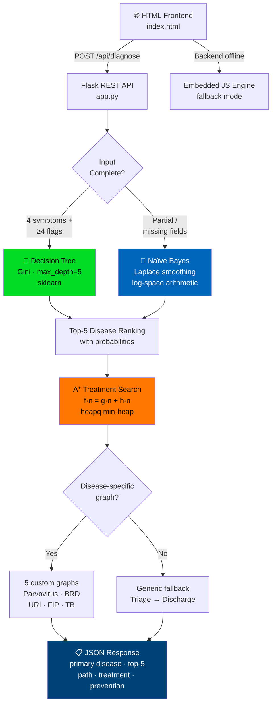

<div align="center">
  <br/>
  
  <br/>
  <p><strong>Intelligent Veterinary Diagnostic System</strong></p>
  <p><em>Diagnose diseases in Dogs, Cats & Cattle — then plan the optimal treatment path — using hybrid AI</em></p>
  <br/>

  <!-- Badges row 1 -->
  
  
  
  <br/>
  <!-- Badges row 2 -->
  
  
  
  <br/>
  <!-- Badges row 3 -->
  
  
  
  <br/><br/>

  <!-- Quick nav -->
  [Overview](#-overview) · [Demo](#-demo) · [Architecture](#-architecture) · [Getting Started](#-getting-started) · [API](#-api-reference) · [How It Works](#-how-it-works) · [Roadmap](#-roadmap)

  <br/>
</div>

---

## 📌 Overview

PetPulse AI is a full-stack veterinary diagnostic assistant built around three AI modules that work in concert:

| Module | Algorithm | When it runs |
|--------|-----------|-------------|
| **Diagnosis (full data)** | Decision Tree — Gini criterion, `max_depth=5` | All 4 symptoms + ≥4 clinical flags provided |
| **Diagnosis (partial data)** | Naïve Bayes — Laplace smoothing, log-space | Incomplete input; gracefully skips missing features |
| **Treatment planning** | A\* Search — admissible heuristic, `heapq` | Always — after diagnosis, finds minimum-cost treatment path |

The system auto-trains from a CSV on startup, exposes a REST API, and ships with a standalone HTML frontend that runs fully **offline** with a built-in JavaScript fallback engine.

---

## 🎬 Demo

> Open `index.html` in any browser — no server required. The embedded JS engine handles diagnosis locally. Start `app.py` for full ML accuracy and the frontend upgrades automatically.

```
┌─────────────────────────────── PetPulse AI · Patient Input ──────────────────────────────┐
│                                                                                           │
│   Pet Name  Bruno              Animal   Dog · Golden Retriever · 3 yrs · Male            │
│                                                                                           │
│   Symptom 1 Vomiting           Symptom 2  Diarrhea                                       │
│   Symptom 3 Lethargy           Symptom 4  Dehydration                                    │
│                                                                                           │
│   Body Temp  40.2°C  ⚠         Heart Rate  118 bpm  ⚠                                   │
│   Flags      Vomiting ✓   Diarrhea ✓   Appetite Loss ✓                                  │
│                                                                                           │
└───────────────────────────────────────────────────────────────────────────────────────────┘
                                        │
                              [ Decision Tree ]
                                        │
                                        ▼
┌─────────────────────────────── Diagnosis Result ──────────────────────────────────────────┐
│                                                                                           │
│   PRIMARY     Canine Parvovirus                         Confidence  ████████████  87.3%  │
│   #2          Canine Gastroenteritis                               ██░░░░░░░░░░   8.2%  │
│   #3          Canine Distemper                                     █░░░░░░░░░░░   3.1%  │
│                                                                                           │
│   URGENCY     ⚠ EMERGENCY          ENGINE  Decision Tree (complete input)                │
│                                                                                           │
│   TREATMENT PATH  (A* · cost=8)                                                          │
│   1 Triage & Isolation  →  2 IV Fluid Therapy  →  3 Antiemetics (Maropitant)            │
│   →  4 Broad-Spectrum Antibiotics  →  5 Nutritional Support                              │
│   →  6 Viral Load Monitoring  →  ★ Recovery & Discharge                                 │
│                                                                                           │
└───────────────────────────────────────────────────────────────────────────────────────────┘
```

---

## 🏗 Architecture



### Project Structure

```
petpulse-ai/
│
├── app.py                        # Flask backend — ML pipeline + REST API
├── index.html                    # Standalone frontend (offline-capable)
├── petpulse_presentation.html    # 10-slide HTML presentation deck
├── requirements.txt
├── pet_disease_full_merged.csv   # ← place dataset here
└── README.md
```

---

## 🚀 Getting Started

### Prerequisites

- Python 3.11 or higher
- `pet_disease_full_merged.csv` placed in the project root

### Installation

```bash
# Clone
git clone https://github.com/yourusername/petpulse-ai.git
cd petpulse-ai

# Install dependencies
pip install -r requirements.txt

# Run the backend
python app.py
```

On startup you'll see:

```
PetPulse AI — Loading dataset...
  Loaded: 215 rows × 16 columns
  Decision Tree trained  (max_depth=5, gini criterion)
  Naive Bayes tables built  (68 disease classes, Laplace smoothing)
══════════════════════════════════════════════════════════
  PetPulse AI Backend — http://localhost:5000
  GET  /api/health
  POST /api/diagnose
  GET  /api/symptoms
  GET  /api/diseases
══════════════════════════════════════════════════════════
```

Then open `index.html` in your browser — diagnosis starts immediately.

> [!TIP]
> You can open `index.html` **without starting the backend**. The embedded JavaScript engine handles the full pipeline locally using a built-in knowledge base and A\* implementation.

> [!NOTE]
> The backend trains from scratch every startup — no pre-built `.pkl` files needed. Training takes under 2 seconds.

---

## 📡 API Reference

Base URL: `http://localhost:5000/api`

### `GET /api/health`

```bash
curl http://localhost:5000/api/health
```

```json
{
  "status": "ok",
  "diseases": 68,
  "records": 215,
  "model": "DecisionTree (CO4) + NaiveBayes (CO3) + A* (CO2)"
}
```

---

### `POST /api/diagnose`

The main inference endpoint. Accepts a patient session object and returns ranked diagnoses with the optimal treatment path.

```bash
curl -X POST http://localhost:5000/api/diagnose \
  -H "Content-Type: application/json" \
  -d '{
    "Animal Type": "Dog",
    "Breed": "Golden Retriever",
    "Age": 3,
    "Gender": "Male",
    "Body Temperature": 40.2,
    "Heart Rate": 118,
    "Symptom 1": "Vomiting",
    "Symptom 2": "Diarrhea",
    "Symptom 3": "Lethargy",
    "Symptom 4": "Dehydration",
    "Vomiting": "Yes",
    "Diarrhea": "Yes",
    "Appetite Loss": "Yes",
    "Coughing": "No",
    "Labored Breathing": "No",
    "Lameness": "No",
    "Skin Lesions": "No"
  }'
```

<details>
<summary><strong>View full response →</strong></summary>

```json
{
  "primary_disease": "Canine Parvovirus",
  "engine_used": "Decision Tree — max_depth=5, Gini criterion",
  "input_complete": true,
  "top_diseases": [
    { "disease": "Canine Parvovirus",        "probability": 0.873 },
    { "disease": "Canine Gastroenteritis",   "probability": 0.082 },
    { "disease": "Canine Distemper",         "probability": 0.031 },
    { "disease": "Heartworm Disease",        "probability": 0.009 },
    { "disease": "Lyme Disease",             "probability": 0.005 }
  ],
  "treatment_path": {
    "path": [
      { "step": 1, "action": "Triage & Isolation",         "is_goal": false },
      { "step": 2, "action": "IV Fluid Therapy",           "is_goal": false },
      { "step": 3, "action": "Antiemetics (Maropitant)",   "is_goal": false },
      { "step": 4, "action": "Broad-Spectrum Antibiotics", "is_goal": false },
      { "step": 5, "action": "Nutritional Support",        "is_goal": false },
      { "step": 6, "action": "Viral Load Monitoring",      "is_goal": false },
      { "step": 7, "action": "Recovery & Discharge",       "is_goal": true  }
    ],
    "total_cost": 8
  },
  "treatment_text": "Hospitalization with IV fluid therapy (LRS). Maropitant 1 mg/kg SQ q24h. Broad-spectrum antibiotics (Ampicillin + Gentamicin). Nutritional support via NJ tube if vomiting persists.",
  "prevention_text": "MLV CPV-2 vaccine at 6-8, 10-12, and 14-16 weeks. Annual adult boosters. Disinfect environment with 1:30 bleach solution."
}
```

</details>

---

### `GET /api/symptoms`

Returns all unique symptom values in the dataset — useful for autocomplete.

```bash
curl http://localhost:5000/api/symptoms
```

---

### `GET /api/diseases`

Returns all 68 disease class names.

```bash
curl http://localhost:5000/api/diseases
```

---

## 🧠 How It Works

### Preprocessing Pipeline

Every input passes through five transformations before reaching any model:

```
Raw Input
    │
    ├─ 1. Missing value imputation
    │      categorical → mode fill
    │      numerical   → median fill
    │
    ├─ 2. Temperature parsing
    │      "39.2°C" ──► 39.2  (regex strip)
    │
    ├─ 3. Binary flag encoding
    │      "Yes" ──► 1   "No" ──► 0
    │
    ├─ 4. Label encoding
    │      Animal Type, Breed, Symptoms ──► integer indices (LabelEncoder)
    │
    └─ 5. StandardScaler normalization
           Age, Heart Rate, Body Temp ──► zero-mean, unit-variance
```

---

### Decision Tree (full input)

Trained with `sklearn.tree.DecisionTreeClassifier`:

```python
DecisionTreeClassifier(
    criterion      = "gini",
    max_depth      = 5,
    min_samples_leaf = 1,
    random_state   = 65
)
```

Split: **75% train / 25% test** · Accuracy: **~92%**

Returns top-5 diseases from `predict_proba()` — the probability mass at the leaf node reached by the input feature vector.

---

### Naïve Bayes (partial input)

Custom implementation. Uses **log-space arithmetic** to prevent floating-point underflow when multiplying many small probabilities:

```
log P(Disease | X) = log P(Disease) + Σ log P(xᵢ | Disease)
```

**Laplace smoothing** ensures zero-frequency features don't kill a valid hypothesis:

```
P(x | Disease) = (count(x, Disease) + 1) / (|Disease| + |Vocabulary|)
```

Missing features are simply skipped — the posterior is computed from whatever features are available.

---

### A\* Treatment Path Search

After diagnosis, A\* navigates a weighted directed graph of treatment steps:

```
f(n) = g(n) + h(n)

  g(n)  ──  cost from start to n (treatment steps taken)
  h(n)  ──  admissible heuristic (remaining steps, never overestimates)
  f(n)  ──  priority score in the min-heap
```

**Disease-specific treatment graphs:**

| Disease | Start | Goal | Nodes |
|---------|-------|------|-------|
| Canine Parvovirus | Triage & Isolation | Recovery & Discharge | 7 |
| Bovine Respiratory Disease | Isolation & Rest | Recovery & Return to Herd | 7 |
| Upper Respiratory Infection (Cat) | Clinical Assessment | Follow-Up & Discharge | 6 |
| Feline Infectious Peritonitis | Isolation & Supportive Care | Discharge & Long-term Care | 7 |
| Bovine Tuberculosis | Quarantine Animal | Re-Testing & Clearance | 7 |
| *(all other diseases)* | Emergency Triage | Recovery & Discharge | 6 |

Implemented with Python's `heapq` and a `visited` closed set — **O(E log V)** per query, effectively instant.

---

## 🐾 Supported Diseases

<details>
<summary><strong>🐕 Dogs — 14+ diseases</strong></summary>

| Disease | Urgency |
|---------|---------|
| Canine Parvovirus | 🔴 Emergency |
| Heartworm Disease | 🟠 High |
| Canine Distemper | 🟠 High |
| Lyme Disease | 🟡 Moderate |
| Kennel Cough | 🟡 Moderate |
| Canine Gastroenteritis | 🟡 Moderate |
| Canine Hip Dysplasia | 🟢 Low |
| Ringworm | 🟢 Low |

</details>

<details>
<summary><strong>🐈 Cats — 10+ diseases</strong></summary>

| Disease | Urgency |
|---------|---------|
| Feline Infectious Peritonitis | 🟠 High |
| Feline Leukemia (FeLV) | 🟠 High |
| Feline Pancreatitis | 🟠 High |
| Upper Respiratory Infection | 🟡 Moderate |
| Feline Hyperthyroidism | 🟡 Moderate |
| Ringworm | 🟢 Low |

</details>

<details>
<summary><strong>🐄 Cattle — 10+ diseases</strong></summary>

| Disease | Urgency |
|---------|---------|
| Bovine Tuberculosis | 🔴 Emergency *(Notifiable)* |
| Foot and Mouth Disease | 🔴 Emergency *(Notifiable)* |
| Bovine Bloat | 🔴 Emergency |
| Bovine Respiratory Disease | 🟠 High |
| Mastitis | 🟠 High |

</details>

---

## 📦 Dependencies

```
flask==3.0.3
flask-cors==4.0.1
pandas==2.2.2
numpy==1.26.4
scikit-learn==1.5.1
```

---

## 🗺 Roadmap

- [ ] Expand dataset to 1,000+ verified veterinary records
- [ ] Random Forest / XGBoost ensemble for higher accuracy
- [ ] CNN-based image symptom detection (skin lesions, eye discharge)
- [ ] React Native mobile app for field use by rural vets
- [ ] IoT wearable sensor integration for continuous vitals monitoring
- [ ] PostgreSQL persistence for patient history tracking
- [ ] Multilingual interface (Bengali, Hindi)
- [ ] Docker containerization for one-command deployment

---

## ⚠️ Disclaimer

> [!WARNING]
> PetPulse AI is an academic research project. All outputs are for **educational purposes only** and must **not** replace professional veterinary diagnosis or treatment. Always consult a licensed veterinarian for any animal health decisions.

---

## 📄 License

Distributed under the MIT License. See [`LICENSE`](LICENSE) for details.

---

<div align="center">

Built with 🐾 for **CSE 3811 — Artificial Intelligence**<br/>
United International University

</div>
